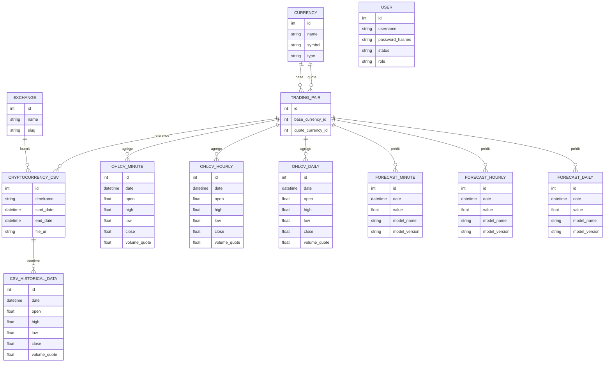

# Modélisation Merise

Ce document formalise la modélisation des données selon l'approche Merise: MCD (Modèle Conceptuel de Données) puis MLD (Modèle Logique de Données) dérivé. Le MPD correspond ici aux définitions SQL/ORM dans `models.py`.

---
## 1. MCD (Modèle Conceptuel de Données)

### Entités (Propriétés essentielles)
1. Currency (id, name, symbol, type, slug?, sign?, rank?, rank_date)
2. Exchange (id, name, slug)
3. TradingPair (id) — Association conceptuelle entre 2 Currency (base, quote)
4. CryptocurrencyCSV (id, timeframe, start_date, end_date, file_url)
5. CSVHistoricalData (id, date, open, high, low, close, volume_quote)
6. OHLCVMinute (id, date, open, high, low, close, volume_quote)
7. OHLCVHourly (id, date, open, high, low, close, volume_quote)
8. OHLCVDaily (id, date, open, high, low, close, volume_quote)
9. User (id, username, password_hashed, status, role)
10. ForecastMinute (id, date, value, model_name?, model_version?)
11. ForecastHourly (id, date, value, model_name?, model_version?)
12. ForecastDaily (id, date, value, model_name?, model_version?)

### Associations & Cardinalités
A. Currency – TradingPair (rôle base / quote) :
   - Une Currency peut être base dans 0..N TradingPair.
   - Une Currency peut être quote dans 0..N TradingPair.
   - Une TradingPair associe exactement 1 base et 1 quote (cardinalité 1,1 de chaque côté sur l’instance choisie).

B. Exchange – CryptocurrencyCSV :
   - Un Exchange référence 0..N CryptocurrencyCSV.
   - Un CryptocurrencyCSV appartient à exactement 1 Exchange.

C. TradingPair – CryptocurrencyCSV :
   - Une TradingPair référence 0..N CryptocurrencyCSV.
   - Un CryptocurrencyCSV lié à exactement 1 TradingPair.

D. CryptocurrencyCSV – CSVHistoricalData :
   - Un CryptocurrencyCSV possède 0..N CSVHistoricalData (lignes OHLCV brutes).
   - Un CSVHistoricalData appartient à exactement 1 CryptocurrencyCSV.

E. TradingPair – OHLCV* (Minute/Hourly/Daily) :
   - Une TradingPair possède 0..N OHLCVMinute / OHLCVHourly / OHLCVDaily.
   - Chaque enregistrement OHLCV* appartient à exactement 1 TradingPair.

F. TradingPair – Forecast* (Minute/Hourly/Daily) :
   - Une TradingPair possède 0..N ForecastMinute / ForecastHourly / ForecastDaily.
   - Chaque Forecast* appartient à exactement 1 TradingPair.

G. User :
   - Entité isolée (pas d’association directe dans le périmètre actuel du MCD avec les autres entités de marché).

### Contraintes Métier Conceptuelles
- (BaseCurrency, QuoteCurrency) unique pour définir une TradingPair.
- (CSVFile, Date) unique dans CSVHistoricalData.
- (TradingPair, Date) unique dans chacune des tables OHLCV* et Forecast*.

Représentation textuelle simplifiée (pseudo-forme) :
```
CURRENCY (1,n) --base--> (1,1) TRADING_PAIR (1,1) <--quote-- (1,n) CURRENCY
EXCHANGE (1,n) -- (0,n) CRYPTOCURRENCY_CSV (1,n) -- (0,n) CSV_HISTORICAL_DATA
TRADING_PAIR (1,n) -- (0,n) OHLCV_MINUTE
TRADING_PAIR (1,n) -- (0,n) OHLCV_HOURLY
TRADING_PAIR (1,n) -- (0,n) OHLCV_DAILY
TRADING_PAIR (1,n) -- (0,n) FORECAST_MINUTE
TRADING_PAIR (1,n) -- (0,n) FORECAST_HOURLY
TRADING_PAIR (1,n) -- (0,n) FORECAST_DAILY
USER (isolée)
```

### Diagramme MCD (Mermaid)


---
## 2. MLD (Modèle Logique de Données – Relationnel)

Traduction relationnelle sous forme de tables et clés (PK = clé primaire, FK = clé étrangère, UQ = contrainte d’unicité).

### Tables & Clés
1. CURRENCIES(
   id PK,
   name NOT NULL,
   symbol NOT NULL,
   slug NULL,
   sign NULL,
   rank NULL,
   rank_date NULL,
   type NOT NULL,
   UQ(name, symbol, rank, type)
)

2. TRADING_PAIRS(
   id PK,
   base_currency_id FK → CURRENCIES.id NOT NULL,
   quote_currency_id FK → CURRENCIES.id NOT NULL,
   UQ(base_currency_id, quote_currency_id)
)

3. EXCHANGES(
   id PK,
   name NOT NULL,
   slug NOT NULL,
   UQ(name, slug)
)

4. CRYPTOCURRENCY_CSV(
   id PK,
   exchange_id FK → EXCHANGES.id NOT NULL,
   trading_pair_id FK → TRADING_PAIRS.id NOT NULL,
   timeframe NOT NULL,
   start_date NOT NULL,
   end_date NOT NULL,
   file_url NOT NULL,
   UQ(exchange_id, trading_pair_id, timeframe)
)

5. CSV_HISTORICAL_DATA(
   id PK,
   csv_file_id FK → CRYPTOCURRENCY_CSV.id NOT NULL,
   date NOT NULL,
   open NOT NULL,
   high NOT NULL,
   low NOT NULL,
   close NOT NULL,
   volume_quote NOT NULL,
   UQ(csv_file_id, date)
)

6. OHLCV_MINUTE(
   id PK,
   trading_pair_id FK → TRADING_PAIRS.id NOT NULL,
   date NOT NULL,
   open NOT NULL,
   high NOT NULL,
   low NOT NULL,
   close NOT NULL,
   volume_quote NOT NULL,
   UQ(trading_pair_id, date)
)

7. OHLCV_HOURLY (mêmes colonnes / contraintes que OHLCV_MINUTE)
8. OHLCV_DAILY (mêmes colonnes / contraintes que OHLCV_MINUTE)

9. USERS(
   id PK,
   username NOT NULL UNIQUE,
   password_hashed NOT NULL,
   status NOT NULL,
   role NOT NULL
)

10. FORECAST_MINUTE(
    id PK,
    trading_pair_id FK → TRADING_PAIRS.id NOT NULL,
    date NOT NULL,
    value NOT NULL,
    model_name NULL,
    model_version NULL,
    UQ(trading_pair_id, date)
)

11. FORECAST_HOURLY (mêmes colonnes / contraintes que FORECAST_MINUTE)
12. FORECAST_DAILY (mêmes colonnes / contraintes que FORECAST_MINUTE)

### Remarques de Normalisation
- 3FN respectée: aucune dépendance transitive non justifiée.
- Tables OHLCV séparées par granularité pour simplifier indexation et performances (évite sparsité de colonnes ou surcharge d’un champ timeframe).
- Historisation implicite par clé (trading_pair_id, date) sans soft delete.

---
## 3. Lien vers MPD
- Le MPD est directement implémenté dans `models.py` via SQLAlchemy (déclarations de classes + contraintes).